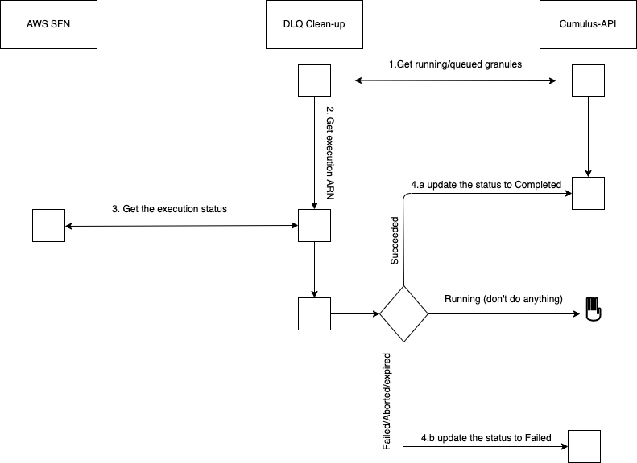

# About
This tool allows to run on demand an ECS fargate task. Was developed for a DAAC operator to run manually a fargate task to manipulate Cumulus data  
# How to use
Install the tool
```code
$pip install git+https://github.com/ghrcdaac/run_fargate_task.git@master#egg=run_task_in_fargate
```
After installing the tool run 
```code
$run-task-in-fargate -h
```
A help text will be shown if the installation is done correctly .
# Use case 1
To solve the discrepancy between the flag showing in Cumulus dashboard (queued) and what really happened (completed) for a collection `foo` version `0` and a collection `bar` version `1`
```code
$run-task-in-fargate -aws_profile <YOUR_AWS_PROFILE>  -cmd "dlq-cleanup -ids foo___0 bar___1" -p <STACK_PREFIX>
```  
Should output a response as follow:
```
{'tasks': [{'attachments': [{'id': '**********', 'type': 'ElasticNetworkInterface', 'status': 'PRECREATED', 'details': [{'name': 'subnetId', 'value': '******'}]}], 'attributes': [{'name': 'ecs.cpu-architecture', 'value': 'x86_64'}], 'availabilityZone': 'us-west-2b', 'clusterArn': 'arn:aws:ecs:us-west-2:*******:cluster/<PREFIX>-CumulusECSCluster', 'containers': [{'containerArn': 'arn:aws:ecs:us-west-2:*******:/, 'taskArn': 'arn:aws:ecs:us-west-2:*******:task/<PREFIX>-CumulusECSCluster/489170ef0947480598b7947bbffefb1c', 'name': 'IMSCorrection', 'image': '*******', 'lastStatus': 'PENDING', 'networkInterfaces': [], 'cpu': '0'}], 'cpu': '256', 'createdAt': datetime.datetime(2022, 3, 29, 10, 7, 27, 177000, tzinfo=tzlocal()), 'desiredStatus': 'RUNNING', 'group': 'family:************', 'lastStatus': 'PROVISIONING', 'launchType': 'FARGATE', 'memory': '1024', 'overrides': {'containerOverrides': [{'name': 'IMSCorrection', 'command': ['dlq-cleanup', '-ids', 'rssmif16d___7']}], 'inferenceAcceleratorOverrides': []}, 'platformVersion': '1.4.0', 'tags': [], 'taskArn': 'arn:aws:ecs:us-west-2:*******:task/<PREFIX>-CumulusECSCluster/489170ef0947480598b7947bbffefb1c', 'taskDefinitionArn': 'arn:aws:ecs:us-west-2:*******:task-definition/<PREFIX>-CorrectIMSTaskDefinition:3', 'version': 1}], 'failures': [], 'ResponseMetadata': {'RequestId': 'b0d9a502-7f26-4d40-9700-df204cf822b7', 'HTTPStatusCode': 200, 'HTTPHeaders': {'x-amzn-requestid': '******', 'content-type': 'application/x-amz-json-1.1', 'content-length': '1514', 'date': 'Today'}, 'RetryAttempts': 0}}

```
Check CloudWatch log group `<PREFIX>-CorrectIMSEcsLogs`. You should see something like
```
{
    "message": "Processing nalmaraw___1",
    "timestamp": "2022-03-29T15:58:25.425560",
    "level": "info"
},
{
    "message": "Successfully updated granule with Granule Id: LC_NALMA_annex_211231_110000.dat",
    "timestamp": "2022-03-29T15:58:30.564985",
    "level": "inf"o
}
```
## DLQ Cleanup UML


## Notes
- This tool is not designed to run for NRT datasets since new granules will be queued and running while this tol is running. You need to run this tool for on-going and static datasets when all their execution is done.
- This tool should run against a collection in a few days (less than 3) period of time. Don't fix DLQ flags after weeks of execution.
- You can use threads to accelerate this correction by adding the flag `-t true` or `--use_threads true` to the `cmd` sent to fargate. This flag will update 20 records in parallel instead of one by one
```
$run-task-in-fargate -aws_profile <YOUR_AWS_PROFILE>  -cmd "dlq-cleanup -ids foo___0 bar___1 -t true" -p <STACK_PREFIX> 
```
# Use case 2
Used to sync missing granules from CMR (granules are pushed to CMR but they don't exit in Cumulus records). <br>
To solve the discrepancy count between Cumulus records and CMR (giving CMR count is bigger) for a collection `foo` version `0` and a collection `bar` version `1`

```code
$run-task-in-fargate -aws_profile <YOUR_AWS_PROFILE>  -cmd "ims-cleanup -ids foo___0 bar___1 -a cmr -p <stack_prefix> -e <cmr_env> -pr <cmr_provider>" -p <STACK_PREFIX>
```  
Should output an AWS response that the task ran successfully. Check the logs in the log group for more info about the task